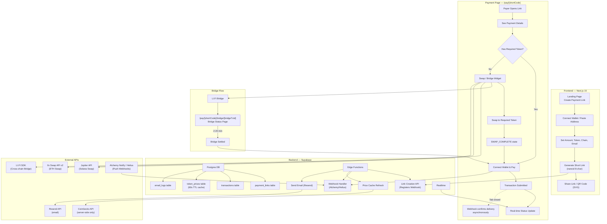

# Envoy — Frictionless Crypto Payment Link Generator

A zero-auth payment link generator with integrated swap/bridge for Solana & Ethereum.

---

## Engineering Mandate

This document serves as the final technical specification for Envoy V1. The protocol operates strictly as a zero-custody, zero-contract execution layer. By delegating state transition verifications entirely to asynchronous indexing (Alchemy/Helius Webhooks) and executing pure native/ERC-20 transfers via the client, we achieve zero smart-contract risk.

## Final Architecture Resolutions (Gap Mitigations)

The following architectural decisions are locked in to mitigate the critical edge cases inherent in client-side Web3 execution.

### Resolution 1: The "ExactOut" Routing Policy
- **Vulnerability:** Standard DEX swaps (ExactIn) suffer from slippage, resulting in insufficient token output to satisfy the exact payment link requirement.
- **Implementation Standard:** The protocol strictly enforces ExactOut routing for all aggregator integrations.
  - **Solana (Jupiter V2 API):** `quote?inputMint={X}&outputMint={Y}&amount={Payment+0.1%}&swapMode=ExactOut`
  - **EVM (0x API V2):** `swap/v1/quote?sellToken={X}&buyToken={Y}&buyAmount={Payment+0.1%}`
  - The 0.1% buffer absorbs token decimal truncation variance.

### Resolution 2: State-Free EVM Execution (Zero Approvals)
- **Vulnerability:** EVM checkouts typically require high-friction Approve → Transfer flows, causing UX drop-offs.
- **Implementation Standard:**
  - **Direct Payments:** Envoy UI constructs raw ERC-20 `transfer(address to, uint256 amount)` calldata locally via `viem/utils` and dispatches via `eth_sendTransaction`. Zero contract approvals required.
  - **Swaps:** Implementation of EIP-2612 (Permit2) via 0x API to batch approvals and execution into a single signature + transaction.

### Resolution 3: Token Allowlist Registry
- **Vulnerability:** "Fee-on-transfer" tokens (e.g., Safemoon) or malicious contract spoofing.
- **Implementation Standard:** The `create-link` Edge Function verifies `token_address` against a hardcoded, Envoy-maintained `StrictTokenList`.
- **Validation:** The `webhook-handler` indexes the value actually received at the target address, automatically rejecting transfers degraded by built-in token taxes.

### Resolution 4: Webhook Finality Thresholds
- **Vulnerability:** RPC webhooks fire on 0-conf blocks. Chain reorgs can result in false-positive "Completed" statuses.
- **Implementation Standard:**
  - **Solana (Helius):** Webhooks configured strictly to `commitment: finalized` (~400ms delay, zero reorg risk).
  - **EVM (Alchemy Notify):** Webhook payload verification enforces `confirmed: true`. For L2s (Arbitrum/Optimism), we accept sequencer finality. For Mainnet Ethereum, execution halts until block depth >= 12.

### Resolution 5: RPC Load Balancing & Transport
- **Vulnerability:** Relying on default Wagmi/WalletAdapter RPCs leads to 429 Rate Limits during high network congestion.
- **Implementation Standard:** Implementation of viem's `fallback()` transport configuration.
  - **EVM Array:** `[Alchemy_Private, Infura_Private, Cloudflare_Public]`
  - **Solana Array:** `[Helius_Private, Triton_Private, Mainnet_Beta_Public]`

### Resolution 6: Native Gas Validation
- **Vulnerability:** User possesses required stablecoins but 0 native gas tokens (ETH/SOL).
- **Implementation Standard:** Pre-flight checks in `usePaymentState` proactively catch `INSUFFICIENT_FUNDS_FOR_GAS`. UI locks the "Pay" button and surfaces: "Requires min 0.005 ETH for network fees."

---

## Decisions

| Decision | Resolution |
|:---|:---|
| **Custody Model** | **Non-custodial.** Payments go directly to the creator's wallet. No funds held by the platform. |
| **Fees** | **No fees for V1.** Direct wallet-to-wallet transfers via simple `transfer` instruction (Solana) / `eth_sendTransaction` (ETH). No smart contract intermediary needed. |
| **Notifications** | Resend email notifications — optional, creator provides email at link creation time. |
| **App Name** | **Envoy.** Short URL domain: `envoy.finance/pay/abc123`. |
| **Token Support** | Default tokens: **USDC, USDT, DAI, WETH, WSOL, EURC, USDe**. |
| **Payment Expiry** | **15 minutes default.** Acts as a live checkout session, protecting the creator from crypto volatility since the payment locks the requested crypto amount. |
| **Fiat Display** | **Enabled.** Provides peace of mind for the payer. Reads from Supabase `token_prices` cache to avoid client-side CoinGecko rate limits. |

---

## Architecture Overview



---

## Tech Stack

| Layer | Technology | Rationale |
|:---|:---|:---|
| **Framework** | Next.js 15 (App Router) | SSR for SEO on landing, CSR for payment pages |
| **Language** | TypeScript | Type safety across the stack |
| **Styling** | Vanilla CSS + CSS Variables | Premium dark theme with glassmorphism |
| **EVM Wallet** | Wagmi v2 + Viem | Industry standard for Ethereum wallet interaction |
| **Solana Wallet** | @solana/wallet-adapter-react | Official Solana wallet adapter |
| **Multi-wallet UI** | RainbowKit (EVM) + Solana Wallet Modal | Production-ready connect UIs |
| **Database** | Supabase (Postgres + pg_cron) | Realtime subscriptions, Edge Functions, single cron job for prices, no infra |
| **Rate Limiting** | Supabase Query | Native DB query checking recent `payment_links` by `creator_address` |
| **Short URL** | nanoid (8 chars, custom alphabet) | URL-safe, collision-resistant, crypto-secure |
| **QR Codes** | qrcode.react (SVG output) | Client-side SVG QR generation — superior for print/share vs PNG |
| **Solana Swap** | Jupiter Swap API v2 | Best Solana DEX aggregator, handles routing |
| **ETH Swap** | 0x Swap API v2 | Best ETH DEX aggregator, Permit2 support |
| **Cross-chain Bridge** | LI.FI SDK (@lifi/sdk) | Aggregates 12+ bridges, supports ETH↔SOL |
| **Price Feeds** | CoinGecko (server-side, cached) | Never called client-side; 60s TTL cache in Supabase via pg_cron |
| **Email** | Resend (@resend/node) | Transactional emails — payment received, bridge status, link expired |
| **Email Templates** | React Email (@react-email/components) | Type-safe, component-based email templates with live preview |
| **Deployment** | Vercel + Supabase | Zero-config, edge-optimized |

---

## Database Schema

### `payment_links` table
```sql
CREATE TABLE payment_links (
  id              UUID DEFAULT gen_random_uuid() PRIMARY KEY,
  short_code      VARCHAR(10) UNIQUE NOT NULL,       -- nanoid 8-char, indexed for O(1) lookups
  idempotency_key VARCHAR(36) UNIQUE NOT NULL,       -- client-generated UUID, prevents double-click duplicates
  
  -- Creator info (no auth required)
  creator_address VARCHAR(64) NOT NULL,              -- wallet address or manual input
  creator_chain   VARCHAR(10) NOT NULL,              -- 'ethereum' | 'solana'
  creator_email   VARCHAR(255),                      -- optional, for Resend email notifications
  
  -- Payment details (no fees — direct wallet-to-wallet)
  token_symbol    VARCHAR(10) NOT NULL,              -- 'ETH', 'SOL', 'USDC', etc.
  token_address   VARCHAR(64),                       -- contract/mint address (null for native)
  amount          DECIMAL(36,18) NOT NULL,            -- requested amount
  
  -- Metadata
  label           VARCHAR(100),                      -- "Coffee payment", "Invoice #123"
  memo            TEXT,                              -- optional note
  
  -- Status & tracking
  status          VARCHAR(20) DEFAULT 'active',
  expires_at      TIMESTAMPTZ,                       -- optional expiry
  created_at      TIMESTAMPTZ DEFAULT now(),
  view_count      INTEGER DEFAULT 0,
  
  CONSTRAINT valid_chain CHECK (creator_chain IN ('ethereum', 'solana')),
  CONSTRAINT valid_status CHECK (status IN ('active', 'completed', 'expired'))
);

CREATE INDEX idx_short_code ON payment_links(short_code);
CREATE INDEX idx_creator ON payment_links(creator_address);
CREATE INDEX idx_status ON payment_links(status);
CREATE INDEX idx_expires ON payment_links(expires_at) WHERE expires_at IS NOT NULL;

-- RLS: public read for active/completed links, service_role-only writes
ALTER TABLE payment_links ENABLE ROW LEVEL SECURITY;

CREATE POLICY "Public read active links"
  ON payment_links FOR SELECT
  USING (status IN ('active', 'completed'));

CREATE POLICY "Service role insert links"
  ON payment_links FOR INSERT
  WITH CHECK (auth.role() = 'service_role');

CREATE POLICY "Service role update links"
  ON payment_links FOR UPDATE
  USING (auth.role() = 'service_role');
```

### `transactions` table
```sql
CREATE TABLE transactions (
  id              UUID DEFAULT gen_random_uuid() PRIMARY KEY,
  link_id         UUID REFERENCES payment_links(id) ON DELETE CASCADE,
  idempotency_key VARCHAR(36) UNIQUE NOT NULL,        -- client-generated, prevents duplicate tx records
  
  -- Payer info
  payer_address   VARCHAR(64) NOT NULL,
  payer_chain     VARCHAR(10) NOT NULL,
  
  -- Transaction details
  tx_hash         VARCHAR(128) UNIQUE NOT NULL,       -- on-chain tx hash
  amount_paid     DECIMAL(36,18) NOT NULL,
  token_paid      VARCHAR(10) NOT NULL,               -- what the payer actually sent
  
  -- Swap info (if applicable)
  was_swapped     BOOLEAN DEFAULT false,
  swap_from_token VARCHAR(10),
  swap_provider   VARCHAR(50),                        -- 'jupiter', '0x'
  
  -- Bridge tracking (separate from payment tx — bridges take 2-20 min)
  bridge_tx_hash    VARCHAR(128) UNIQUE,              -- bridge-specific tx hash for status polling
  bridge_status     VARCHAR(20),                      -- 'bridging', 'bridge_complete', 'bridge_failed'
  bridge_provider   VARCHAR(50),                      -- 'mayan', 'allbridge', 'wormhole'
  bridge_started_at TIMESTAMPTZ,
  bridge_settled_at TIMESTAMPTZ,
  
  -- Status
  status          VARCHAR(20) DEFAULT 'pending',
  confirmed_at    TIMESTAMPTZ,
  created_at      TIMESTAMPTZ DEFAULT now(),
  
  CONSTRAINT valid_tx_status CHECK (status IN ('pending', 'confirmed', 'failed')),
  CONSTRAINT valid_bridge_status CHECK (
    bridge_status IS NULL OR bridge_status IN ('bridging', 'bridge_complete', 'bridge_failed')
  )
);

CREATE INDEX idx_link_id ON transactions(link_id);
CREATE INDEX idx_tx_hash ON transactions(tx_hash);
CREATE INDEX idx_pending ON transactions(status, created_at) WHERE status = 'pending';
CREATE INDEX idx_bridging ON transactions(bridge_status) WHERE bridge_status = 'bridging';

-- RLS: public read for status display, service_role-only writes
-- Prevents fake "completed" records without on-chain verification
ALTER TABLE transactions ENABLE ROW LEVEL SECURITY;

CREATE POLICY "Public read transactions"
  ON transactions FOR SELECT USING (true);

CREATE POLICY "Service role insert transactions"
  ON transactions FOR INSERT
  WITH CHECK (auth.role() = 'service_role');

CREATE POLICY "Service role update transactions"
  ON transactions FOR UPDATE
  USING (auth.role() = 'service_role');
```

### `token_prices` table
```sql
CREATE TABLE token_prices (
  id            VARCHAR(20) PRIMARY KEY,             -- 'ETH', 'SOL', 'USDC', etc.
  price_usd     DECIMAL(20,8) NOT NULL,
  updated_at    TIMESTAMPTZ DEFAULT now()
);

-- Refreshed by pg_cron every 60s via Edge Function → CoinGecko batch call
-- Client reads from here, never calls CoinGecko directly (avoids rate limits)
ALTER TABLE token_prices ENABLE ROW LEVEL SECURITY;
CREATE POLICY "Public read prices" ON token_prices FOR SELECT USING (true);
CREATE POLICY "Service role write prices" ON token_prices FOR INSERT WITH CHECK (auth.role() = 'service_role');
CREATE POLICY "Service role update prices" ON token_prices FOR UPDATE USING (auth.role() = 'service_role');
```

### `email_logs` table
```sql
CREATE TABLE email_logs (
  id            UUID DEFAULT gen_random_uuid() PRIMARY KEY,
  link_id       UUID REFERENCES payment_links(id) ON DELETE CASCADE,
  tx_id         UUID REFERENCES transactions(id) ON DELETE SET NULL,
  
  -- Delivery info
  to_email      VARCHAR(255) NOT NULL,
  template      VARCHAR(30) NOT NULL,                -- 'payment_received', 'bridge_started', 'bridge_settled', 'link_expired'
  resend_id     VARCHAR(64),                         -- Resend message ID for deliverability tracking
  status        VARCHAR(20) DEFAULT 'sent',          -- 'sent', 'delivered', 'bounced', 'failed'
  
  created_at    TIMESTAMPTZ DEFAULT now(),
  
  CONSTRAINT valid_template CHECK (
    template IN ('payment_received', 'bridge_started', 'bridge_settled', 'link_expired')
  )
);

CREATE INDEX idx_email_link ON email_logs(link_id);

-- Deduplication: send-email checks for existing link_id + tx_id + template before sending
-- Prevents duplicate emails from duplicate webhook deliveries

ALTER TABLE email_logs ENABLE ROW LEVEL SECURITY;
CREATE POLICY "Service role only" ON email_logs
  USING (auth.role() = 'service_role');
```

### pg_cron Schedules
```sql
-- Price cache refresh: single batch CoinGecko call, upserted into token_prices
SELECT cron.schedule(
  'refresh-token-prices',
  '* * * * *',
  $$
    SELECT net.http_post(
      url := 'https://<project>.supabase.co/functions/v1/refresh-prices',
      headers := '{"Authorization": "Bearer <service_role_key>"}'::jsonb
    );
  $$
);
```

> [!NOTE]
> **All writes go through Edge Functions** using the `service_role` key. The client calls Edge Functions (not Supabase directly) for any mutation:
> - `createPaymentLink()` → calls Edge Function `create-link`
> - `recordTransaction()` → calls Edge Function `record-transaction`
> - Status updates → pushed via Alchemy/Helius Webhooks

---

## Staged Deployment Plan & Git Architecture

Development must proceed sequentially to isolate variables. Swap logic must not be introduced until peer-to-peer validation is confirmed.

### Phase 1: Environment & Architecture Shell
**Objective:** Boilerplate, security headers, and static routing.
- `feat(core):` initialize Next.js 15 app router, TS strict mode, Tailwind
- `chore(config):` implement Content-Security-Policy and HTTP security headers
- `feat(ui):` implement design system tokens (colors, glassmorphism, typography)
- `feat(ui):` build Landing Page layout and Create Link form shell
- `feat(ui):` build static PaymentCard and QRCodeSVG generator components

### Phase 2: Decentralized Storage & Idempotency
**Objective:** Supabase provisioning, edge functions, and rate limiting.
- `feat(db):` provision payment_links and transactions tables with RLS
- `feat(db):` enforce UNIQUE constraints on tx_hash and idempotency_key
- `feat(api):` implement create-link edge function with nanoid generation
- `security(api):` enforce StrictTokenList validation in create-link
- `feat(api):` build record-transaction edge function for intent logging
- `feat(client):` integrate form with create-link API and localstorage LRU

### Phase 3: Web3 Core — Direct Execution
**Objective:** Non-custodial transfers (The core value proposition).
- `feat(web3):` configure Wagmi v2 + Viem with fallback RPC transports
- `feat(web3):` setup Solana Wallet Adapter with custom Helius RPC
- `feat(ui):` implement unified WalletConnect abstract component
- `feat(state):` build usePaymentState engine for deterministic UI routing
- `feat(evm):` construct ERC-20 calldata and execute eth_sendTransaction
- `feat(solana):` construct and execute raw SPL Token transfer instructions
- `refactor(ui):` wire SmartButton execution to handle direct payments

### Phase 4: The Routing Engine (Swaps)
**Objective:** ExactOut aggregators and state recovery.
- `feat(swap):` implement resilient 2-phase swap state machine (sessionStorage)
- `feat(api):` integrate Jupiter v2 API for Solana ExactOut routing
- `feat(api):` integrate 0x v2 API + Permit2 for EVM ExactOut routing
- `feat(ui):` build inline SwapWidget with price impact and route display
- `feat(flow):` link SWAP_COMPLETE state to PAYMENT_PENDING execution
- `fix(swap):` implement error boundaries for user-rejected txs and slippage

### Phase 5: Cross-Chain Liquidity
**Objective:** EVM ↔ Solana bridges via LI.FI.
- `feat(bridge):` integrate @lifi/sdk for cross-chain execution
- `feat(ui):` build /bridge/[txId] sub-route for long-polling UI
- `feat(flow):` implement auto-redirect hook on bridge settlement success
- `refactor(ui):` update usePaymentState to process WRONG_CHAIN as bridge intent

### Phase 6: Asynchronous Fulfillment (Webhooks)
**Objective:** Untrusting the client. Final confirmation handled backend-side.
- `feat(api):` build webhook-handler edge function for Alchemy/Helius
- `security(api):` verify webhook HMAC signatures and enforce finality depth
- `feat(db):` cross-reference incoming webhook value with requested link amount
- `feat(email):` compile React Email templates to static HTML strings
- `feat(api):` integrate Resend SDK inside secured send-email edge function
- `feat(cron):` schedule pg_cron task for 60s CoinGecko token_prices cache
- `feat(client):` subscribe to Supabase Realtime for UI confirmation state
- `chore(ci):` setup GitHub Actions for Vercel deployment and linting

---

## Detailed Component Specifications

### Phase 1 — Project Foundation & Design System

#### [NEW] Project Setup
- Initialize Next.js 15 project with TypeScript in `C:\Users\Tyra\.gemini\antigravity-ide\scratch\envoy`
- Configure Supabase client
- Set up environment variables structure

#### [NEW] `next.config.ts`
- Content Security Policy and security headers defined from day one:

```typescript
const cspHeader = `
  default-src 'self';
  script-src 'self' 'unsafe-eval' 'unsafe-inline';
  style-src 'self' 'unsafe-inline';
  img-src 'self' blob: data: https:;
  font-src 'self' https://fonts.gstatic.com;
  connect-src 'self'
    https://*.supabase.co
    https://api.jup.ag
    https://api.0x.org
    https://li.quest
    https://api.resend.com
    wss://*.walletconnect.com
    https://*.walletconnect.com
    https://*.infura.io
    https://*.alchemy.com
    https://rpc.helius.xyz;
  frame-src 'self' https://verify.walletconnect.com;
  object-src 'none';
  base-uri 'self';
  form-action 'self';
  frame-ancestors 'none';
  upgrade-insecure-requests;
`;

const securityHeaders = [
  { key: 'Content-Security-Policy', value: cspHeader.replace(/\n/g, '') },
  { key: 'X-Frame-Options', value: 'DENY' },
  { key: 'X-Content-Type-Options', value: 'nosniff' },
  { key: 'Referrer-Policy', value: 'strict-origin-when-cross-origin' },
  { key: 'Permissions-Policy', value: 'camera=(), microphone=(), geolocation=()' },
];
```

> [!NOTE]
> CSP includes `unsafe-eval` and `unsafe-inline` for script-src because wallet connectors (WalletConnect, RainbowKit) require it. Tighten with nonces in a future hardening pass.

#### [NEW] `src/styles/globals.css`
- Complete dark-mode-first design system
- CSS custom properties for colors, spacing, typography
- Glassmorphism card styles, gradient backgrounds
- Animated button states, micro-animations
- Responsive grid system

#### [NEW] `src/styles/variables.css`
- Design tokens: colors (deep purple/electric blue gradient palette), spacing scale, typography (Inter font family), border-radius, shadows, z-index layers

---

### Phase 2 — Core Pages & Components

#### [NEW] `src/app/page.tsx` — Landing / Link Creator
- Hero section with gradient animation
- Two-step flow:
  1. Connect wallet (auto-detects chain) **OR** paste any ETH/SOL address
  2. Set token, amount, optional label/memo, optional email
- Generate link → copy to clipboard + QR code (SVG)
- Recent links list stored in localStorage with LRU eviction (max 20 links)

#### [NEW] `src/app/pay/[shortCode]/page.tsx` — Payment Page
- Fetches payment details from Supabase via `shortCode`
- Shows: amount, token, chain, label, memo, creator address (truncated)
- Uses **SmartButton** component (driven by `usePaymentState`) for all connection, swap, and payment actions
- If payer doesn't have the required token → swap widget appears inline
- Detects `SWAP_COMPLETE` state from sessionStorage and shows "Resume Payment" instead of re-triggering swap
- If `bridge_status = 'bridging'` exists for this link, auto-redirects to bridge status page
- Real-time status indicator (listening to Supabase Realtime)

#### [NEW] `src/app/pay/[shortCode]/bridge/[txId]/page.tsx` — Bridge Status Page
- Dedicated page for cross-chain bridge tracking (bridges take 2-20 minutes — needs its own UX)
- Progress bar with estimated time remaining based on bridge provider
- LI.FI `getStatus()` polling for bridge settlement
- Auto-redirect to payment page when bridge settles
- Resumable: if payer closes tab and returns to payment link, gets redirected here

#### [NEW] `src/components/WalletConnect.tsx`
- Unified component supporting both EVM (RainbowKit) and Solana (Wallet Adapter)
- **Edge Case Fix (Hydration):** Wrapped using `next/dynamic` with `{ ssr: false }` to force purely client-side rendering. This prevents Next.js hydration clashes between Wagmi (`ssr: true` capable) and Solana Wallet Adapter (client-side only).
- Chain selector toggle (ETH ⟷ SOL)
- Address display with copy button

#### [NEW] `src/components/PaymentForm.tsx`
- Token selector dropdown (filtered by selected chain)
- Amount input with fiat equivalent display (reads from `token_prices` table, not CoinGecko)
- Label/memo optional fields
- Optional email field — "Get notified when paid" (validated client-side, stored as `creator_email`)
- Expiry time selector (15m, 1h, 24h, 7d, never)

#### [NEW] `src/components/ui/SmartButton.tsx`
- High-performance, responsive primary action component consuming `usePaymentState`.
- **DISCONNECTED:** "Connect Wallet to Pay" → opens chain selector modal.
- **WRONG_CHAIN:** "Switch to [Network]" → triggers programmatic switch.
- **INSUFFICIENT_BALANCE:** "Swap to [Token]" → mounts inline SwapWidget.
- **SWAP_RESUMABLE:** "Resume Final Payment" → skips swap, goes straight to transfer.
- **READY_TO_PAY:** "Pay [Amount] [Token]" → invokes non-custodial transfer, transitions to loading spinner.

#### [NEW] `src/components/PaymentCard.tsx`
- Glassmorphic card showing payment details on the pay page
- Animated status indicator (pulse for pending, checkmark for confirmed)
- Chain/token icons

#### [NEW] `src/components/SharePanel.tsx`
- Generated short link with copy button
- QR code display using `QRCodeSVG` — downloadable as SVG file for print/share quality
- Share buttons (Twitter, Telegram, WhatsApp, copy link)

```tsx
import { QRCodeSVG } from 'qrcode.react';

<QRCodeSVG value={paymentUrl} size={200} level="H" id="payment-qr" />

function downloadQR() {
  const svg = document.getElementById('payment-qr');
  const svgData = new XMLSerializer().serializeToString(svg!);
  const blob = new Blob([svgData], { type: 'image/svg+xml' });
  const url = URL.createObjectURL(blob);
  // trigger download...
}
```

#### [NEW] `src/components/SwapWidget.tsx`
- Inline swap/bridge interface on the payment page
- Auto-detects payer's token balances
- Shows best swap route via Jupiter (Solana) or 0x (ETH)
- Cross-chain bridge option via LI.FI if payer is on wrong chain
- Checks state machine for `SWAP_COMPLETE` before offering a new swap — prevents wasteful re-swaps

#### [NEW] `src/components/TransactionStatus.tsx`
- Real-time transaction tracking
- Animated progress states: Submitted → Confirming → Confirmed
- Explorer link (Etherscan / Solscan)
- Differentiates between direct payment and bridge+payment flows

#### [NEW] `src/components/BridgeStatus.tsx`
- Bridge-specific progress UI with estimated time
- Shows bridge provider, source chain, destination chain
- Animated progress bar for bridge settlement

---

### Phase 3 — Wallet & Blockchain Integration

#### [NEW] `src/lib/providers.tsx`
- Unified context wrapper combining Wagmi, React Query, RainbowKit, and Solana Connection/Wallet providers.
- EVM: `getDefaultConfig` from RainbowKit with `ssr: true`. Pins `metaMaskWallet`, `coinbaseWallet`, and `walletConnectWallet`.
- Solana: `WalletProvider` with `autoConnect={true}`, loads `PhantomWalletAdapter` and `SolflareWalletAdapter`.
- **Hydration Safety:** Enforces defensive mounted state flag inside `useEffect`. Returns loading skeleton if server/client snapshots don't match to prevent Next.js SSR hydration crashes.

#### [NEW] `src/lib/wagmi-config.ts`
- Wagmi v2 configuration: chains, transports, connectors (injected, WalletConnect, Coinbase)

#### [NEW] `src/lib/solana-config.ts`
- Solana connection setup, wallet adapter configuration
- Phantom, Solflare, Backpack wallet support

#### [NEW] `src/lib/tokens.ts`
- Token registry: symbol, name, address, decimals, chain, icon URL
- For both ETH and SOL ecosystems
- `getTokenPrice(symbol)` reads from `token_prices` table — never calls external APIs client-side

#### [NEW] `src/lib/payment/usePaymentState.ts`
- Unified custom hook aggregating Wagmi (`useAccount`, `useChainId`, `useSwitchChain`), Solana (`useWallet`, `useConnection`), and local swap state.
- Computes a single deterministic state string:
  1. `DISCONNECTED`: No active wallet.
  2. `WRONG_CHAIN`: Connected, but chain ID/ecosystem doesn't match `creator_chain`.
  3. `INSUFFICIENT_BALANCE`: Correct chain, but wallet balance < required `amount`.
  4. `SWAP_RESUMABLE`: `SWAP_COMPLETE` flag present in sessionStorage.
  5. `READY_TO_PAY`: Connected, correct chain, sufficient balance.

#### [NEW] `src/lib/payment.ts`
```typescript
export type FeeConfig = {
  bps: number;        // e.g. 50 = 0.5%
  collector: string;  // wallet address
};
```
- `createPaymentLink(feeConfig: FeeConfig | null = null)` — generates nanoid short code + client idempotency key, calls `create-link` Edge Function
- `fetchPaymentLink(shortCode)` — retrieves payment details from Supabase (public SELECT)
- `executePayment(feeConfig: FeeConfig | null = null)` — constructs and sends the on-chain transaction (direct transfer, no fees for V1), records via `record-transaction` Edge Function
- `saveRecentLink()` / `getRecentLinks()` — localStorage with LRU eviction at 20 items:

```typescript
const MAX_RECENT_LINKS = 20;
const STORAGE_KEY = 'envoy_recent_links';

function saveRecentLink(link: RecentLink): void {
  const existing = JSON.parse(localStorage.getItem(STORAGE_KEY) || '[]');
  const filtered = existing.filter((l: RecentLink) => l.shortCode !== link.shortCode);
  const updated = [link, ...filtered];
  localStorage.setItem(STORAGE_KEY, JSON.stringify(updated.slice(0, MAX_RECENT_LINKS)));
}
```

- All mutations include client-generated `idempotency_key` (UUID v4) — stored in `sessionStorage`, sent with every write request, prevents duplicate records on double-click or network retry within the same session.
- **Edge Case Fix (Idempotency Volatility):** Since `sessionStorage` doesn't persist across devices (e.g., desktop to mobile QR scan), the ultimate source of truth for preventing duplicate fulfillment relies on the `tx_hash` and `bridge_tx_hash` `UNIQUE` constraints in the database.

---

### Phase 4 — Swap & Bridge Integration

#### [NEW] `src/lib/swap/state-machine.ts`
The swap → pay flow is **not atomic**. If the swap succeeds but payment transfer fails, the payer has swapped tokens with no clear next step. This module enforces a strict two-phase state machine:

```
IDLE → QUOTING → SWAP_PENDING → SWAP_COMPLETE → PAYMENT_PENDING → PAYMENT_CONFIRMED
                       ↓                              ↓
                  SWAP_FAILED                   PAYMENT_FAILED
                                                      ↓
                                               RESUME_PAYMENT (uses already-swapped balance)
```

- State persisted to `sessionStorage` keyed by `${shortCode}:${payerAddress}`
- If payer navigates away after `SWAP_COMPLETE` and returns, payment page shows **"Resume Payment"** button
- `PAYMENT_FAILED` surfaces a clear error with retry using already-swapped tokens
- Exports: `getSwapState()`, `setSwapState()`, `clearSwapState()`, `canResumePayment()`

#### [NEW] `src/lib/swap/jupiter.ts`
- Jupiter Swap API v2 integration
- `getQuote(inputMint, outputMint, amount)` → best route
- `buildSwapTransaction(quote, userPublicKey)` → unsigned tx
- Execute swap + payment in sequence, updating state machine at each step

#### [NEW] `src/lib/swap/zerox.ts`
- 0x Swap API v2 integration
- `getPrice(sellToken, buyToken, amount)` → indicative price
- `getQuote(sellToken, buyToken, amount)` → firm quote with calldata
- Token approval handling (Permit2)

#### [NEW] `src/lib/swap/lifi.ts`
- LI.FI SDK integration for cross-chain bridging
- `getRoutes(fromChain, toChain, fromToken, toToken, amount)` → bridge routes
- `executeRoute(route, signer)` → execute bridge transaction
- `getBridgeStatus(bridgeTxHash)` → poll for bridge settlement via LI.FI status API
- Stores `bridge_tx_hash` separately from payment `tx_hash` in transactions table

#### [NEW] `src/lib/swap/index.ts`
- Unified swap/bridge orchestrator
- Determines optimal path: same-chain swap vs cross-chain bridge
- Uses state machine — checks `canResumePayment()` before initiating new swaps
- Two-phase execution: swap first → confirm swap succeeded → then execute payment transfer

---

### Phase 5 — Supabase Backend

#### [NEW] `supabase/migrations/001_create_tables.sql`
- All tables defined above: `payment_links`, `transactions`, `token_prices`, `email_logs`
- All RLS policies, indexes, constraints, and CHECK constraints
- pg_cron schedule for price refresh (every 60s)

#### [NEW] `src/lib/supabase.ts`
- Supabase client initialization (anon key for reads)
- Typed database interface (generated from schema)
- Realtime subscription helpers
- Edge Function call helpers (for all writes)

#### [NEW] `supabase/functions/create-link/index.ts`
- Edge Function for payment link creation
- Validates input: address format, token exists, amount > 0, `creator_email` format (if provided)
- Generates nanoid short code
- **Registers Webhook:** Adds `creator_address` to Alchemy Notify (EVM) or Helius Webhooks (Solana) to listen for incoming transfers.
- Enforces idempotency via DB UNIQUE constraint — duplicate key returns existing link
- Rate-limited: max 10 links per address per minute natively via Supabase:
  ```typescript
  const { count } = await supabase
    .from('payment_links')
    .select('*', { count: 'exact', head: true })
    .eq('creator_address', creatorAddress)
    .gte('created_at', new Date(Date.now() - 60_000).toISOString());

  if (count && count >= 10) {
    return new Response('Rate limit exceeded', { status: 429 });
  }
  ```

#### [NEW] `supabase/functions/record-transaction/index.ts`
- Edge Function for recording payment transactions
- Validates tx_hash format
- Enforces idempotency via DB UNIQUE constraint
- Client calls this to log intent, but actual confirmation awaits the webhook payload.

#### [NEW] `supabase/functions/webhook-handler/index.ts`
- Unified webhook receiver for Alchemy Notify and Helius push events.
- Verifies webhook signature to ensure payload authenticity.
- Extracts `tx_hash`, amount, token, and recipient (`creator_address`).
- **Cross-References Payment:** Fetches `payment_links` row to verify incoming amount + token match the requested payment exactly (prevents personal transfers from triggering completion).
- Matches against `transactions` table (if missing, creates one to handle direct non-app transfers if needed).
- **Deduplication First:** Checks `transactions` and `email_logs` for duplicate webhook deliveries (ignores if tx is already confirmed).
- If verified: Updates `transactions.status` to `confirmed` and `payment_links.status` to `completed`.
- **De-registers Webhook:** Only after DB update, calls Alchemy/Helius API to remove the `creator_address` from the webhook watcher to prevent indefinite tracking.
- On confirmation: triggers `send-email` with `payment_received` template (if `creator_email` is set).
- Handles edge cases like bridge slippage (if webhook fires on destination chain, bridge is successful).

#### [NEW] `supabase/functions/refresh-prices/index.ts`
- Edge Function called by pg_cron every 60 seconds
- Batch-fetches prices from CoinGecko `/simple/price` (single API call for all tokens)
- Upserts into `token_prices` table
- Client reads from `token_prices`, never calls CoinGecko directly

#### [NEW] `supabase/functions/send-email/index.ts`
- Central Edge Function for all outbound email via Resend
- Called internally by `webhook-handler` and future functions
- **Never exposed to client** — only callable by other Edge Functions
- Uses `RESEND_API_KEY` env var (service_role secret)
- Accepts `{ to, template, data }` payload
- Renders the appropriate React Email template server-side
- Sends via Resend SDK, logs to `email_logs` table with `resend_id`
- **Deduplication:** Checks `email_logs` for existing entry with same `link_id + tx_id + template` before sending — prevents duplicate emails from cron retries

---

### Phase 6 — Email Templates

**Edge Case Fix (Deno JSX Compilation):** Because Supabase Edge Functions run on Deno, which struggles with React Email JSX runtime compilation, these templates will be **pre-rendered into static HTML strings** during a build step before deploying the Edge Functions. This keeps templates clean while ensuring robust edge execution.

#### [NEW] `supabase/functions/_shared/emails/PaymentReceived.tsx`
React Email template for payment confirmation:
- Creator's payment link label (or "Payment Received")
- Amount + token + chain
- Payer address (truncated)
- Transaction hash with explorer link (Etherscan/Solscan)
- Fiat equivalent (from cached price)
- CTA button: "View Payment" → links to `/pay/[shortCode]`
- Styled with Envoy branding (dark theme matching the app)

#### [NEW] `supabase/functions/_shared/emails/BridgeStarted.tsx`
React Email template sent when a cross-chain bridge is initiated:
- "A payment is being bridged to your wallet"
- Estimated time range based on bridge provider
- Bridge provider name, source chain → destination chain
- CTA: "Track Bridge Status" → `/pay/[shortCode]/bridge/[txId]`

#### [NEW] `supabase/functions/_shared/emails/BridgeSettled.tsx`
React Email template sent when bridge settles and payment completes:
- "Bridge complete — payment received!"
- Full transaction details (amount, token, tx hash)
- Time taken for bridge
- CTA: "View Payment" → `/pay/[shortCode]`

#### [NEW] `supabase/functions/_shared/emails/LinkExpired.tsx`
React Email template sent when a payment link with email expires unfulfilled:
- "Your payment link has expired"
- Link details (amount, token, label)
- CTA: "Create New Link" → homepage
- Only sent if link had views but no payment (avoid spamming for unused links)

---

## App Flow Summary

### Creator Flow (3 clicks to payment link)
```
1. Land on homepage
2. Connect wallet OR paste address
3. Enter amount + select token + (optional) email for notifications
4. Click "Generate Link" → calls create-link Edge Function → get short URL + QR (SVG)
5. Share via any channel
6. If email provided → receive confirmation when someone pays
```

### Payer Flow — Direct Payment
```
1. Open short link → payment page
2. See amount, token, who's requesting (prices from cached token_prices table)
3. Connect wallet → Approve & Pay (direct transfer, no fees)
4. Transaction recorded via record-transaction Edge Function
5. Alchemy/Helius detects transfer → fires push webhook to webhook-handler
6. Edge Function confirms payment in Supabase
7. Real-time confirmation shown to both parties via Supabase Realtime
8. Creator gets "Payment Received" email (if email was provided)
```

### Payer Flow — Swap Required
```
1. Open short link → payment page
2. State machine: IDLE
3. Don't have required token → Swap widget
4. Get quote (Jupiter/0x) → State: QUOTING
5. Execute swap → State: SWAP_PENDING → SWAP_COMPLETE
6. Execute payment → State: PAYMENT_PENDING
7a. Success → Webhook fires → State: PAYMENT_CONFIRMED ✓
7b. Failure → State: PAYMENT_FAILED → "Resume Payment" button
7c. Tab closed → Webhook still fires on delivery, confirming payment asynchronously.
```

### Payer Flow — Cross-Chain Bridge
```
1. Open short link → wrong chain detected
2. LI.FI finds best bridge route
3. Execute bridge → redirect to /pay/[shortCode]/bridge/[txId]
4. Creator gets "Bridge Started" email (if email was provided)
5. Bridge status page shows progress (2-20 min)
6. Bridge settles → auto-redirect back to payment page → execute payment
7. Webhook fires on destination chain delivery
8. Creator gets "Bridge Settled — Payment Received" email
```

### Short URL Format
```
https://envoy.finance/pay/a7Bx9kQ2    ← 8-char nanoid
```

---

## Verification Plan

### Automated Tests
```bash
# Type checking
npx tsc --noEmit

# Build verification
npm run build

# Lint
npm run lint
```

### Manual Verification
- **Creator flow**: Connect MetaMask → create ETH/USDC payment link → verify short URL works
- **Creator flow**: Connect Phantom → create SOL/USDC payment link → verify
- **Paste address flow**: Manually enter ETH address → generate link
- **Idempotency**: Double-click "Generate Link" → verify only one link created
- **Payer flow**: Open generated link → verify payment details display
- **Swap recovery**: Swap tokens → simulate payment failure → verify "Resume Payment" appears
- **Orphaned tx**: Submit payment → close tab → wait for webhook → verify Supabase status updates to completed
- **Bridge flow**: Initiate cross-chain bridge → verify bridge status page renders → wait for LI.FI polling + webhook
- **Swap widget**: Open link requiring USDC → verify Jupiter/0x quote fetching
- **QR code**: Download QR → verify it's SVG format → scan → verify it opens correct payment page
- **Price feeds**: Verify fiat values display from cached `token_prices`, not client-side API calls
- **Realtime**: Submit payment → verify status updates live on both creator and payer screens
- **Responsive**: Test on mobile viewport → verify full flow works
- **Link expiry**: Create link with 1h expiry → verify it shows expired after timeout
- **CSP**: Open browser DevTools console → verify no CSP violations during normal flow
- **RLS**: Attempt direct Supabase insert from client → verify it's rejected
- **localStorage**: Create 25 links → verify only 20 stored, oldest evicted
- **Email — payment received**: Create link with email → complete payment → verify email delivered via Resend dashboard
- **Email — bridge flow**: Initiate bridge on a link with email → verify "bridge started" email → wait for settlement → verify "bridge settled" email
- **Email — deduplication**: Trigger duplicate webhook events on same tx → verify only one email sent (check `email_logs` table)
- **Email — no email**: Create link without email → complete payment → verify no email sent, no errors
- **Email — link expired**: Create link with email + 1h expiry → wait for expiry → verify "link expired" email (only if link had views)

> [!WARNING]
> **Testnet First:** All blockchain interactions will be built against **Ethereum Sepolia** and **Solana Devnet** during development. Mainnet toggle will be a simple env var switch. Swap/bridge APIs may have limited testnet support — we'll mock those for initial testing and verify on mainnet with small amounts.

---

## Project Structure
```
envoy/
├── src/
│   ├── app/
│   │   ├── layout.tsx                    # Root layout with providers
│   │   ├── page.tsx                      # Landing / link creator
│   │   └── pay/
│   │       └── [shortCode]/
│   │           ├── page.tsx              # Payment page
│   │           └── bridge/
│   │               └── [txId]/
│   │                   └── page.tsx      # Bridge status page
│   ├── components/
│   │   ├── WalletConnect.tsx
│   │   ├── PaymentForm.tsx
│   │   ├── PaymentCard.tsx
│   │   ├── SharePanel.tsx
│   │   ├── SwapWidget.tsx
│   │   ├── TransactionStatus.tsx
│   │   ├── BridgeStatus.tsx
│   │   └── ui/
│   │       ├── SmartButton.tsx           # Dynamic execution engine
│   │       ├── Button.tsx
│   │       ├── Input.tsx
│   │       ├── Select.tsx
│   │       ├── Card.tsx
│   │       └── Badge.tsx
│   ├── lib/
│   │   ├── providers.tsx
│   │   ├── wagmi-config.ts
│   │   ├── solana-config.ts
│   │   ├── supabase.ts
│   │   ├── tokens.ts
│   │   ├── payment/
│   │   │   └── usePaymentState.ts        # State engine hook
│   │   ├── payment.ts
│   │   └── swap/
│   │       ├── index.ts
│   │       ├── state-machine.ts          # Two-phase swap recovery
│   │       ├── jupiter.ts
│   │       ├── zerox.ts
│   │       └── lifi.ts
│   └── styles/
│       ├── globals.css
│       └── variables.css
│
│   # Email templates live in supabase/functions/_shared/emails/
│   # They are server-side only (React Email) — never shipped to client bundle
├── supabase/
│   ├── migrations/
│   │   └── 001_create_tables.sql         # All tables, RLS, pg_cron schedules
│   ├── functions/
│   │   ├── _shared/
│   │   │   └── emails/                   # React Email templates (server-side only)
│   │   │       ├── PaymentReceived.tsx
│   │   │       ├── BridgeStarted.tsx
│   │   │       ├── BridgeSettled.tsx
│   │   │       └── LinkExpired.tsx
│   │   ├── create-link/
│   │   │   └── index.ts
│   │   ├── record-transaction/
│   │   │   └── index.ts
│   │   ├── webhook-handler/
│   │   │   └── index.ts                  # Handles Alchemy & Helius push webhooks
│   │   ├── send-email/                   # Central email dispatcher via Resend
│   │   │   └── index.ts
│   │   └── refresh-prices/              # pg_cron: CoinGecko → token_prices cache
│   │       └── index.ts
│   └── .env.example                      # RESEND_API_KEY, RESEND_FROM_EMAIL
├── public/
│   └── tokens/
├── .env.local.example
├── next.config.ts                        # CSP + security headers
├── tsconfig.json
└── package.json
```
